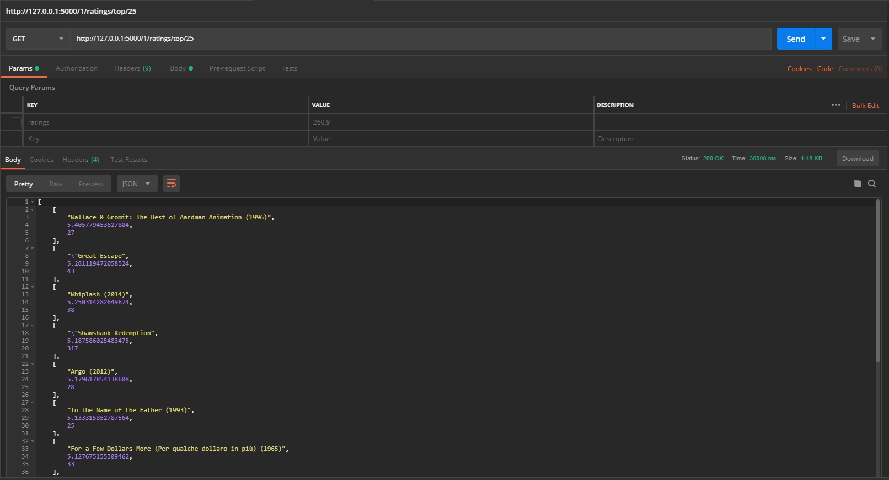
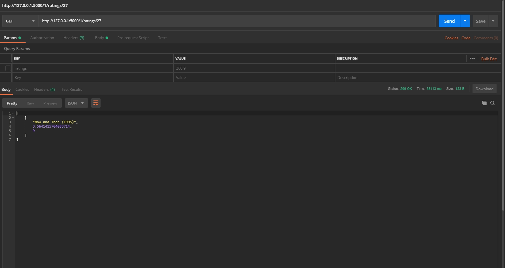
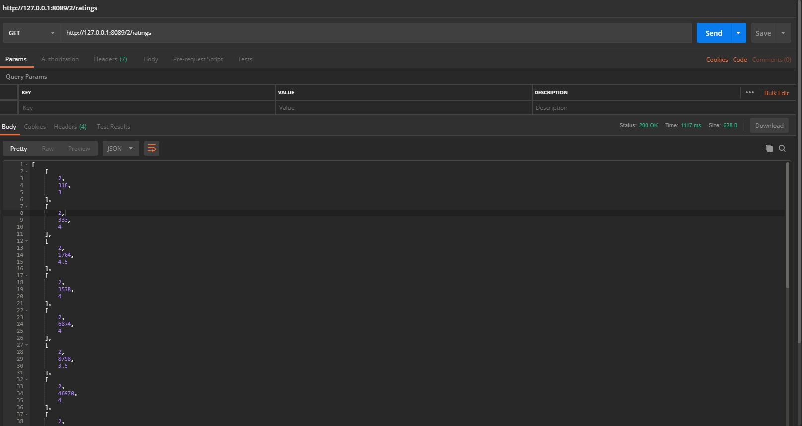
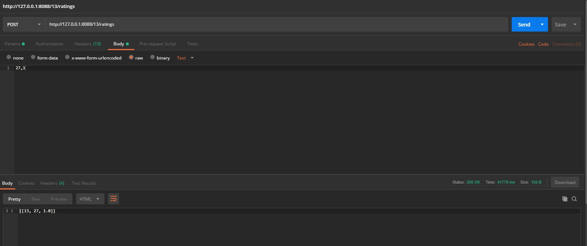

# Reccomendation System with ALS

*engine.py* : Define the Reccomendation Engine and wrapping all spark related computation  
*app.py* : Flask web app that define RESTful API and its functionality   
*server.py* : Initialises a CherryPy web server for *app.py* and create Spark Context for *engine.py*

## REST API :
+ `Top Ratings` : GET /__{user_id}__/ratings/top/__{movies_count}__
+ `Movie Ratings` : GET /__{user_id}__/ratings/__{movies_id}__
+ `All User Ratings` : GET /__{user_id}__/ratings/
+ `Add Ratings` : POST /__{user_id}__/ratings/ *#raw data __{movie_id,rating}__*

### API Images :
+ Top Ratings  

+ Movie Ratings  

+ All User Ratings  

+ Add Ratings  

