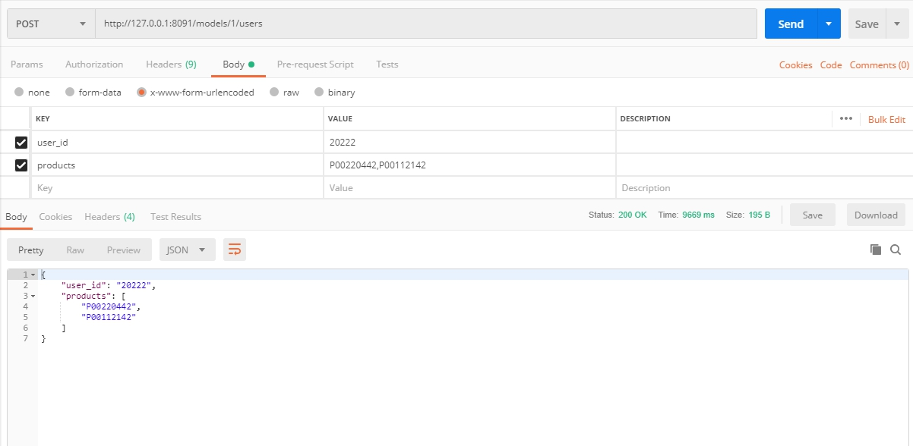
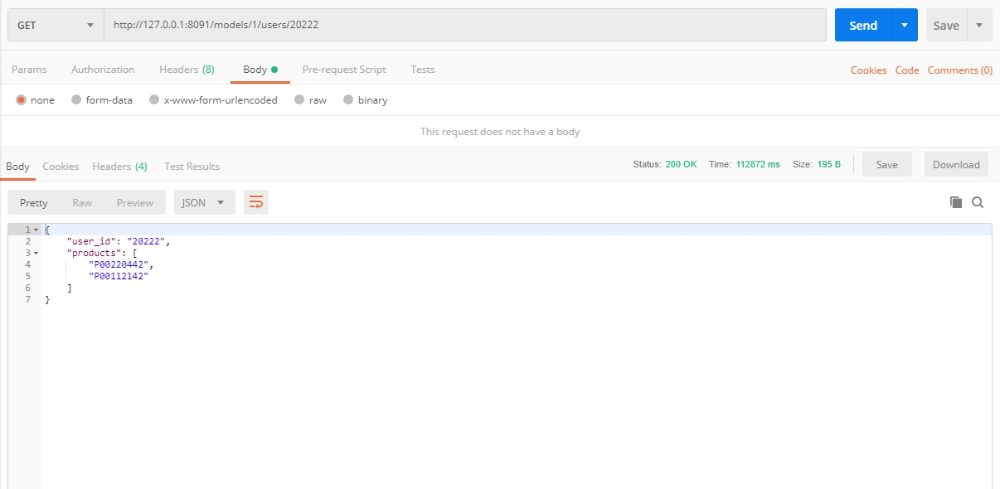
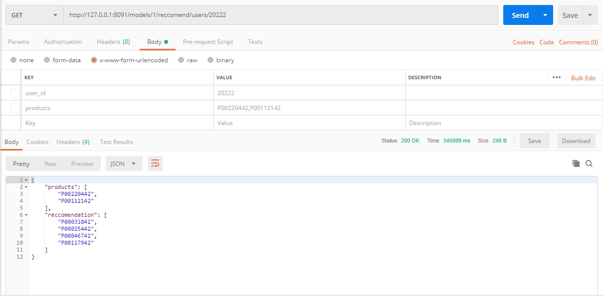
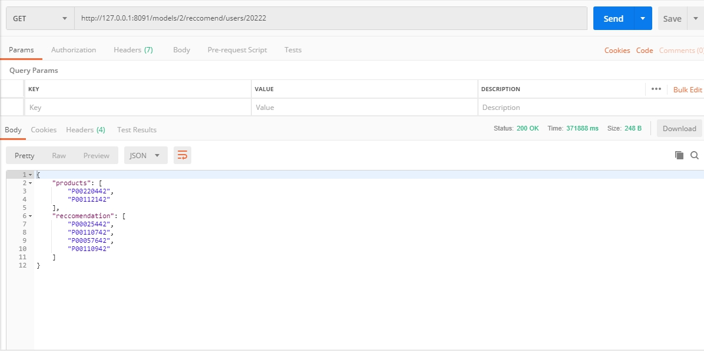
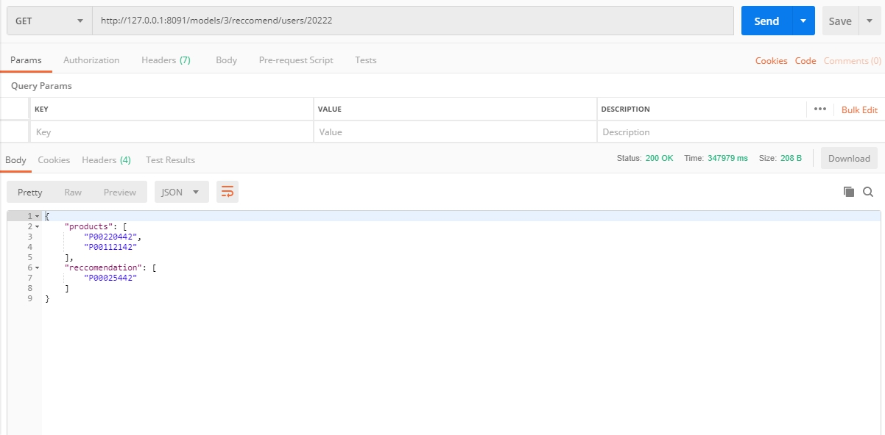

# Reccomendation Product Black Friday
*engine.py* : Define the Reccomendation Engine and wrapping all spark related computation  
*app.py* : Flask web app that define RESTful API, its functionality, initialize *Spark Session* and *CherryPy* web Server   

## REST API :
+ `Create User` : POST /models/__{models_id}__/users - body: user_id : \<int\>, products: \<string\>
+ `Get User by Id` : GET /models/__{models_id}__/users/__{user_id}__
+ `Reccomend Product to User` : GET /models/__{models_id}__/users/__{user_id}__

### API Images :
+ Create User  

+ Get User by Id  

+ Reccomend Product to User  
Each model reccomend different product(s)
    + Model 1
    
    + Model 2
    
    +Model 3
    

